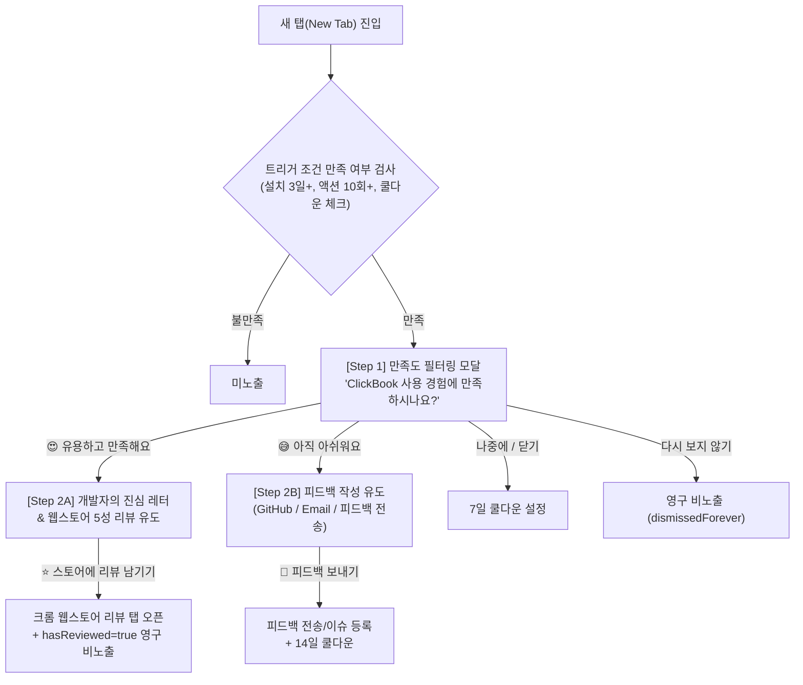

# ClickBook 진정성 있는 리뷰 유도 프롬프트 시스템 기획 및 설계서

## 1. 개요 및 목적
* **목표**: ClickBook을 일정 기간 활발히 사용하며 만족도를 경험한('Aha Moment') 사용자에게 1인 개발자의 진정성 있는 메시지를 전달하여 **크롬 웹스토어 5성 리뷰를 대량 확보**하고, 불만족 사용자에게는 **내부 피드백 채널을 제공하여 1점 평점 테러를 원천 차단**합니다.
* **핵심 원칙**:
  1. **극도의 사용자 배려**: 설치 직후 노출 금지, 최소 3일 이상 사용 및 핵심 활동 지표 달성 시에만 노출.
  2. **스마트 2단계 퍼널 (2-Step Funnel)**: 만족(5성 스토어 유도) vs 아쉬움(내부 피드백/개선 유도) 분기.
  3. **완벽한 7개 국어 로컬라이징**: 지원 언어(ko, en, ja, zh-TW, de, es, fr)별 원어민 수준의 자연스러운 감성 카피라이팅.
  4. **Figma급 고품질 UI/UX**: 라이트/다크 모드 완벽 분리, 컴팩트한 여백, 부드러운 마이크로 인터랙션.

---

## 2. 스마트 2단계 퍼널 (2-Step Funnel Workflow)



---

## 3. 트리거 조건 및 빈도 제어 규칙 (Eligibility & Cooldown)

### 3.1 노출 자격 조건 (AND 조건)
1. **설치 경과 시간**: 최초 설치 후 **최소 3일 (72시간)** 경과 (`Date.now() - installedAt >= 3 * 86400000`)
2. **핵심 활동 지표 누적**:
   - 새 탭 방문 횟수 >= **15회**
   - 또는 북마크 추가/정리 횟수 >= **10회**
   - 또는 투두/메모/스프링노트/마인드맵 항목 생성 >= **5회**
3. **상태 플래그 확인**:
   - `hasReviewed !== true` (이미 리뷰를 작성하러 간 사용자는 영구 제외)
   - `dismissedForever !== true` ('다시 보지 않기' 누른 사용자 영구 제외)
   - `Date.now() > snoozedUntil` ('나중에' 선택 시 설정된 쿨다운 경과 여부)
   - `shownCount < 3` (최대 3회 노출 후에도 미작성 시 자동 영구 숨김 처리하여 피로도 방지)

### 3.2 노출 위치 및 애니메이션
* **노출 위치**: 새 탭 대시보드 (`src/newtab/App.tsx`) 중앙 모달 (팝업창에는 노출하지 않음).
* **애니메이션**: 페이지 로드 후 1.2초 뒤 부드러운 Scale & Fade-in 효과 적용.

---

## 4. 7개 국어 로컬라이징(i18n) 카피라이팅 매트릭스

`src/shared/i18n/`의 7개 언어 파일(`ko.ts`, `en.ts`, `ja.ts`, `zh-TW.ts`, `de.ts`, `es.ts`, `fr.ts`)에 추가될 번역 텍스트입니다.

| i18n Key | 한국어 (`ko`) | English (`en`) | 日本語 (`ja`) |
| :--- | :--- | :--- | :--- |
| **`reviewStep1Title`** | ClickBook과 함께한 시간, 만족스러우셨나요? | Enjoying your experience with ClickBook? | ClickBookの使い心地はいかがですか？ |
| **`reviewStep1Desc`** | 여러분의 생산적인 웹 생활을 위해 매일 발전하고 있습니다. 솔직한 느낌을 알려주세요! | We strive every day to boost your browsing productivity. How has it been for you? | より快適なブラウジング体験をお届けできるよう改善を続けています。率直なご感想をお聞かせください！ |
| **`reviewStep1Positive`** | 😍 아주 유용하고 만족해요! | 😍 Loving it, very useful! | 😍 とても便利で満足しています！ |
| **`reviewStep1Negative`** | 😅 아직 조금 아쉬워요 | 😅 Needs some improvement | 😅 まだ少し物足りない点があります |
| **`reviewStep2LoveTitle`** | 💌 개발자의 진심을 담은 작은 편지 | 💌 A Note from the Developer | 💌 開発者からのささやかなお願い |
| **`reviewStep2LoveMsg`** | 안녕하세요! ClickBook은 광고 없는 깔끔한 생산성 도구를 만들기 위해 **1인 개발자가 매일 밤 열정으로 가꿔가는 무료 프로젝트**입니다.<br/><br/>대규모 마케팅 없이, **사용자님의 따뜻한 별점 5점 리뷰 하나**가 ClickBook을 계속 유지하고 발전시키는 가장 큰 원동력이 됩니다. 30초만 시간을 내어 응원의 별점을 남겨주실 수 있을까요? | Hi there! ClickBook is a passion project built and maintained by a **solo developer** to create a clean, distraction-free productivity space.<br/><br/>With no marketing budget, **your 5-star review is the single biggest fuel** that keeps this free project alive and improving. Could you spare 30 seconds to leave a kind review? | こんにちは！ClickBookは、クリーンで快適な生産性ツールを目指し、**個人開発者が情熱を注いで開発している完全無料プロジェクト**です。<br/><br/>広告宣伝を行っていないため、**皆様からの「★5レビュー」**が本プロジェクトを維持・アップデートし続ける最大の原動力になります。30秒だけお時間をいただき、応援のレビューをいただけませんか？ |
| **`reviewStep2LoveBtn`** | ⭐ 30초 만에 스토어 리뷰 남기기 | ⭐ Support with 5 Stars (30s) | ⭐ 30秒で応援レビューを書く |
| **`reviewStep2FeedbackTitle`** | 더 나은 ClickBook을 위한 의견 🙇 | How can we make it better? 🙇 | 改善に向けたご意見をお聞かせください 🙇 |
| **`reviewStep2FeedbackMsg`** | 아쉬운 점이나 불편하셨던 부분을 알려주시면, 다음 업데이트에 최우선으로 개선하여 보답하겠습니다! | We're sorry ClickBook didn't meet your expectations. Tell us what went wrong and we'll prioritize fixing it in the next update! | ご不便をおかけして申し訳ありません。改善してほしい点や機能のリクエストをぜひお聞かせください。最優先でアップデートに反映いたします！ |
| **`reviewStep2FeedbackBtn`** | 💬 개선 의견 남기기 | 💬 Send Feedback / Issue | 💬 改善要望・フィードバックを送る |
| **`reviewLaterBtn`** | ☕ 나중에 하기 | ☕ Maybe later | ☕ あとで |
| **`reviewNeverBtn`** | 다시 보지 않기 | Don't show again | 今後表示しない |

*(독일어 `de`, 스페인어 `es`, 프랑스어 `fr`, 번체중문 `zh-TW` 역시 동일한 감성과 뉘앙스로 완벽 구현)*

---

## 5. 데이터 스토리지 스키마 (`chrome.storage.local`)

```typescript
export interface ReviewPromptState {
  installedAt: number;        // 최초 설치 일시 (타임스탬프)
  newTabOpenCount: number;    // 새 탭 열기 누적 횟수
  actionCount: number;        // 북마크/투두/메모 등 핵심 인터랙션 누적 횟수
  shownCount: number;         // 팝업 노출된 총 횟수 (최대 3회)
  snoozedUntil: number;       // 쿨다운 만료 시각 (타임스탬프)
  hasReviewed: boolean;       // 스토어 리뷰 링크 클릭 여부 (영구 숨김)
  dismissedForever: boolean;  // '다시 보지 않기' 클릭 여부 (영구 숨김)
}
```

---

## 6. UI/UX 디자인 상세 사양

1. **레이아웃 & 비주얼**:
   - 모달 크기: `max-w-md` (440px), 컴팩트하고 알찬 정보 밀도.
   - 배경: 세련된 Glassmorphism 백드롭 (`backdrop-blur-sm bg-black/40`).
   - 테마:
     - **Light Mode**: 깨끗한 순백색 카드 (`bg-white border-neutral-200 text-neutral-900`), 부드러운 섀도우 (`shadow-2xl`).
     - **Dark Mode**: 딥 다크 챠콜 카드 (`bg-neutral-900 border-neutral-800 text-neutral-100`).
2. **버튼 스타일링**:
   - 메인 CTA (스토어 리뷰): 그라데이션 포인트 컬러 (`bg-gradient-to-r from-amber-500 to-orange-500 text-white shadow-lg hover:brightness-110 active:scale-[0.98]`).
   - 보조 버튼: 깔끔한 고스트/아웃라인 버튼 (`hover:bg-neutral-100 dark:hover:bg-neutral-800 text-neutral-500`).
3. **액션 처리**:
   - `⭐ 리뷰 남기기` 클릭 시: 크롬 웹스토어 리뷰 URL (`https://chromewebstore.google.com/detail/clickbook-ai-bookmark-ta/.../reviews`)을 새 탭으로 열고 `hasReviewed = true` 저장 후 모달 닫기.
   - `💬 개선 의견 남기기` 클릭 시: GitHub Issues 링크 (`https://github.com/Junpapapo/ClickBook/issues/new`) 또는 피드백 메일 열기.

---

## 7. 구현 계획 및 검증 단계

### Phase 1: 스토리지 헬퍼 및 사용량 트래킹 훅 개발
* `src/shared/storage.ts`: `ReviewPromptState` 기본값 및 카운터 증가 유틸리티 함수 구현.
* `src/hooks/useReviewPrompt.ts`: 노출 자격 판단(Eligibility Check), 스누즈, 영구 닫기, 리뷰 완료 트리거 훅 작성.

### Phase 2: 다국어(i18n) 7개 언어 딕셔너리 확장
* `src/shared/i18n/` 내 `en.ts`, `ko.ts`, `ja.ts`, `zh-TW.ts`, `de.ts`, `es.ts`, `fr.ts`에 리뷰 프롬프트 키셋 등록.

### Phase 3: `ReviewPromptModal` 컴포넌트 개발
* `src/components/ReviewPromptModal.tsx` 제작 (Step 1 만족도 선택 ↔ Step 2A/2B 분기 전환).
* `src/newtab/App.tsx`에 연동.

### Phase 4: 검증
* TypeScript 무결성 검증 (`npx tsc --noEmit`).
* 프로덕션 빌드 검증 (`npm run build`).
* 수동 테스트 시뮬레이션 (개발자 모드에서 강제 트리거 및 7개 언어/다크·라이트 테마 시각적 검증).
