# ClickBook 프로젝트 전반적 개선 및 고도화 심층 분석 보고서

## 1. 개요
ClickBook (v1.6.8)은 Manifest V3 기반의 올인원 브라우저 스마트 북마크 & 생산성 플랫폼으로, **NewTab 대시보드, 웹 인젝션 플로팅 버디(Buddy), 스프링노트(Tiptap 기반 리치 텍스트), 투두/캘린더, 실시간 트렌드 랭킹, 리더 모드, 광고 차단 엔진** 등 방대하고 유용한 기능들이 잘 통합되어 있습니다.

본 분석에서는 **(1) 스토리지 및 데이터 안정성, (2) 성능 및 인젝션 번들 최적화, (3) 기능 고도화 기회, (4) UI/UX 디자인 일관성, (5) 크로스 브라우징 & 코드 품질**의 5개 핵심 축을 중심으로 프로젝트를 진단하고 구체적인 고도화 방안을 도출했습니다.

---

## 2. 영역별 심층 분석 및 진단 결과

```mermaid
graph TD
    A[ClickBook v1.6.8] --> B[1. 데이터/스토리지 안정성]
    A --> C[2. 성능 및 번들 최적화]
    A --> D[3. 핵심 기능 고도화]
    A --> E[4. UI/UX 및 디자인 품질]
    A --> F[5. 크로스 브라우징 및 유지보수]

    B --> B1[스프링노트/리더모드 백업 누락 방지]
    B --> B2[대용량 북마크 스토리지 I/O 병목 해소]
    B --> B3[방문 배치 큐 유실 방지]

    C --> C1[Buddy Content Script 794KB -> 경량 로더화]
    C --> C2[대용량 북마크 가상 스크롤 Virtualization]
    C --> C3[본문 전문 검색 인덱싱 최적화]

    D --> D1[데드 링크 감지 & 아카이브 연동]
    D --> D2[리더 모드 TTS 음성 읽기]
    D --> D3[스프링노트 다이어그램/리치 임베드]
    D --> D4[포커스 타이머 - 투두 태스크 연동]

    E --> E1[High-Density 콤팩트 레이아웃 정밀화]
    E --> E2[라이트/다크 테마 토큰 무결성]
    E --> E3[5px 슬림 스크롤바 일관성]

    F --> F1[Whale / Safari / Edge / Firefox 완전 호환]
    F --> F2[7개 국어 i18n 번역 키 자동 동기화]
```

---

### 🔍 영역 1. 데이터 및 스토리지 안정성 (Data & Storage Integrity)

| 문제점 / 개선 대상 | 상세 분석 내용 | 권장 고도화 방안 |
| :--- | :--- | :--- |
| **스프링노트 백업 누락** | `exportData()` / `importData()`에서 IndexedDB(`clickbook_spring_note_db`)에 저장된 스프링노트 데이터와 `pageContents`가 제외되어 있음. | 백업/복원 JSON 포맷에 스프링노트와 첨부 이미지/리더모드 캐시를 포함하여 기기 이전 시 완벽한 데이터 보존 지원 |
| **대용량 북마크 스토리지 병목** | `clickbook_data` 단일 키에 전체 북마크 배열을 `JSON.stringify`로 통째로 쓰고 읽는 구조 (수천 개 북마크 시 단일 수정에도 수 MB 직렬화/역직렬화 I/O 발생). | 북마크 ID 맵 기반 샤딩 또는 변경된 아이템 델타(Delta) 업데이트 구조 도입 |
| **방문 카운트 인메모리 유실 위험** | `storage.ts`의 `visitBatchQueue`가 모듈 레벨 변수로 존재하여 MV3 서비스 워커 종료나 탭 닫힘 시 400ms 디바운스 대기 중인 카운트가 유실될 수 있음. | `beforeunload` / `visibilitychange` 플러시 핸들러 보강 및 스토리지 안전 커밋 보장 |
| **IndexedDB 라이프사이클** | `springNoteDb.ts`에서 `onversionchange` 등 멀티 탭 환경의 DB 연결 충돌 처리 부족. | IndexedDB 연결 에러 복구 및 자동 재연결(Re-connect) 메커니즘 추가 |

---

### ⚡ 영역 2. 성능 및 번들 최적화 (Performance & Bundling)

| 문제점 / 개선 대상 | 상세 분석 내용 | 권장 고도화 방안 |
| :--- | :--- | :--- |
| **Content Script 비대화 (794 kB)** | `content-entry.ts`가 모든 웹페이지(`http/https`)에 주입되며 번들 크기가 약 **794 kB**에 달함. 버디를 꺼둔 사용자에게도 매 탭마다 800KB JS가 파싱됨. | **초경량 부트스트래퍼(~5KB 로더)** 패턴 적용: 설정 확인 후 활성화된 경우에만 동적 `import()`로 핵심 엔진/패널 지연 로딩 (웹서핑 오버헤드 95% 절감) |
| **CSS Raw String 인젝션** | `BUDDY_STYLES` 115KB의 거대 스타일시트가 raw string으로 번들에 하드코딩됨. | Constructable Stylesheet (`CSSStyleSheet` & `adoptedStyleSheets`) 활용으로 스타일 파싱 메모리 및 렌더링 비용 대폭 절감 |
| **NewTab 북마크 가상화 부재** | 북마크가 수백~수천 개인 경우 `Dashboard`, `FolderView`, `TagBoard` 등에서 모든 카드가 일괄 DOM 노드로 생성되어 초기 렌더링/스크롤 프레임 드랍 유발. | 가상 스크롤(Virtual Windowing) 또는 점진적 지연 렌더링 적용으로 10,000개 북마크도 60fps 보장 |
| **본문 전문 검색 CPU 부하** | `smartMatchFields`가 수백 개 웹페이지의 전체 텍스트(`pageContents`)를 타이핑할 때마다 메인 스레드에서 직접 순회 검색. | Inverted Index(역인덱스) 캐싱 또는 Web Worker 검색 오프로딩으로 타이핑 반응 속도 0ms 달성 |

---

### 🚀 영역 3. 기능 고도화 & 생산성 극대화 (Feature Upgrades)

| 고도화 기능 | 상세 내용 및 기대 효과 |
| :--- | :--- |
| **1. 데드 링크(Dead Link 404) 감지 & 웹 아카이브 연동** | 북마크된 사이트가 폐쇄되거나 404 에러가 발생하는지 백그라운드에서 검사하고, 원클릭으로 Wayback Machine(웹 아카이브) 저장본으로 복구 연결. |
| **2. 리더 모드(Reader Mode) TTS 음성 읽기 & 오디오 플레이어** | 저장된 웹 아티클을 Web Speech API (브라우저 표준 TTS)를 통해 팟캐스트처럼 들을 수 있는 오디오 플레이어 탑재. |
| **3. 스프링노트(SpringNote) 리치 임베드 & 다이어그램** | 북마크 링크를 드롭하면 예쁜 리치 북마크 카드(썸네일, 요약)로 임베드되고, Mermaid / 마크다운 다이어그램을 실시간 렌더링 지원. |
| **4. 포커스 타이머 ↔ 투두 태스크 밀착 연동** | 뽀모도로 타이머 진행 시 특정 투두 태스크를 지정하여 해당 태스크에 실제 투입된 집중 시간(분)을 누적 기록하고 통계 차트 제공. |
| **5. 스마트 태그 자동 클러스터링 & AI 추천** | 유사한 북마크들을 의미 기반으로 자동 그룹핑하고 폴더 정리를 원클릭으로 제안하는 스마트 어시스턴트 기능. |

---

### 🎨 영역 4. UI/UX 디자인 & 인터랙션 (Avant-Garde & Compact Guidelines)

1. **Compact & High-Density Padding 전면 검수**:
   - 대시보드 위젯, 사이드바 트리, 모달 팝업의 불필요한 마진/패딩을 미세 조정하여 시원하고 밀도 높은 정보 전달력 확보.
2. **라이트/다크/세피아 테마 일관성**:
   - 라이트 모드에서 어두운 차콜/이질적 배경색 사용을 배제하고 깨끗한 화이트/슬레이트 톤 유지.
   - 다크 모드에서는 깊이감 있는 딥 다크(`slate-900`/`surface-950`)와 정교한 입체 보더 적용.
3. **5px 슬림 스크롤바 & Zero Clipping**:
   - 긴 텍스트(`min-w-0`), 태그 칩(`flex-shrink-0`), 모달 바닥 잘림 완벽 방지.
4. **브라우저 기본 팝업 금지 준수**:
   - `alert`, `confirm`, `prompt` 대신 `useDialog` 기반 모던 커스텀 UI 전면 유지.

---

### 🌐 영역 5. 크로스 브라우징 및 다국어 (Cross-Browser & i18n)

1. **전체 브라우저 호환성 (Whale, Edge, Safari, Firefox, Chrome)**:
   - `chrome.*` 표준 API 래핑 및 Manifest 사양 점검으로 네이버 웨일, MS 엣지, 파이어폭스, 사파리 웹 익스텐션에서 100% 동일 동작 보장.
2. **7개 국어(ko, en, ja, zh-CN, zh-TW, de, es) 번역 키 전수 검사**:
   - 신규 기능 추가에 따른 번역 누락 키 자동 감지 및 Fallback 안전장치 마련.

---

## 3. 추천 개선 단계 (Roadmap)

### 📌 [Phase 1: 기반 안정성 & 핵심 성능 최적화] (최우선)
- [ ] **Content Script 경량화**: `content-entry.ts`를 초경량 로더로 분리하여 웹서핑 시 로딩 오버헤드 90% 이상 절감.
- [ ] **스프링노트 백업/복원 연동**: `exportData()` / `importData()`에 IndexedDB 스프링노트 데이터 포함.
- [ ] **스토리지 락 타임아웃 & 방문 배치 큐 안정화**: 예기치 않은 브라우저 종료 시 데이터 보존.

### 📌 [Phase 2: UI/UX & 렌더링 퍼포먼스 고도화]
- [ ] **대용량 북마크 가상화(Virtualization)**: 대시보드 및 폴더 뷰 대용량 북마크 렌더링 최적화.
- [ ] **High-Density 패딩 및 테마 정밀 튜닝**: 모달, 사이드바, 위젯 간 밀착 배치 및 다크/라이트 테마 완성도 강화.
- [ ] **검색 엔진 인덱싱 최적화**: 본문 검색 속도 향상.

### 📌 [Phase 3: 기능 고도화 & 생산성 융합]
- [ ] **리더 모드 TTS 음성 읽기 플레이어 추가**.
- [ ] **포커스 타이머와 투두 태스크 집중 시간 연동**.
- [ ] **스프링노트 리치 북마크 임베드 & Mermaid 다이어그램 지원**.
- [ ] **데드 링크(404) 감지 & 웹 아카이브 복구 연동**.
