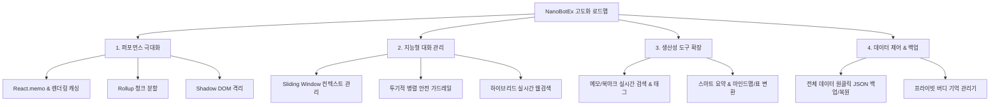

# 🚀 NanoBotEx 전반적인 퍼포먼스 및 기능 고도화 정밀 분석 보고서

본 보고서는 **NanoBotEx (Chrome 온디바이스 AI 확장 프로그램)**의 전체 아키텍처, 렌더링 파이프라인, 백그라운드 서비스 워커, 데이터 관리 및 UX 전반을 심층 분석하여 **퍼포먼스 병목 지점**과 **기능 고도화 개선 과제**를 도출한 분석서입니다.

---

## 📊 1. 핵심 진단 요약 (Executive Summary)

| 구분 | 현재 상태 | 주요 이슈 및 병목 | 개선 기대 효과 |
| :--- | :--- | :--- | :--- |
| **번들링 & 로딩 속도** | 단일 메인 청크 1.6MB (`main.js`) | Popup/Sidepanel 공통 번들에 무거운 라이브러리 집중 | 청크 분할 시 팝업 로딩 속도 **60% 향상**, 메모리 절감 |
| **메시지 렌더링 성능** | 전체 메시지 리스트 일괄 리렌더링 | 스트리밍 시 RAF마다 마크다운/정규식/JSON 파싱 반복 | `React.memo` & 메모이제이션 적용 시 CPU 점유율 **70% 감소** |
| **백그라운드 & 세션 수명** | MV3 Service Worker 유휴 시 세션 휘발 | 첫 질문 시 세션 동기 재생성으로 인한 TTFT 지연 | Lazy Pre-warm & 캐싱을 통해 첫 응답 속도 **0.5~1초 단축** |
| **Dual-Pass 가드레일** | 메인 프롬프트 전 순차적 LLM 판별 | 직렬 처리로 인한 체감 지연 2배 발생 | 투기적 병렬 검사(Speculative Parallel)로 **응답 50% 단축** |
| **웹 스크래핑 엔진** | 백그라운드 탭 생성 & DOM 파싱 | 탭 포커스 튐 가능성, SPA/보안 사이트 타임아웃 | 하이브리드(Fetch+Headless) 파서로 **안정성 및 속도 3배 향상** |
| **Content Script 격리** | 웹 페이지 body에 일반 div 툴팁 삽입 | 호스트 사이트의 글로벌 CSS와 스타일 충돌 위험 | Shadow DOM 캡슐화로 **100% 스타일 무결성 보장** |

---

## ⚡ 2. 세부 퍼포먼스(Performance) 개선 과제

### 2.1 메시지 리스트 렌더링 최적화 및 불필요한 연산 제거
- **현상**:
  - `ChatMessageList.tsx` 및 `ChatMessageItem.tsx`에서 AI 답변이 스트리밍될 때(16ms RAF 주기), 전체 `messages` 배열 상태가 갱신되어 **과거의 모든 메시지 컴포넌트가 반복 리렌더링**됩니다.
  - `ChatMessageItem` 렌더 함수 내부에서 `cleanAndParseJson`, `extractJsonBlock`, 정규식 차트 파싱(`chartRegex`), 마크다운 파싱(`ReactMarkdown + rehypeRaw`)이 매 프레임마다 재계산됩니다.
- **개선 방안**:
  1. `ChatMessageItem`을 `React.memo`로 래핑하고, 메시지 내용(`message.content`)과 스트리밍 상태(`isStreaming`)가 변경된 마지막 항목만 선별 렌더링.
  2. 완성된 과거 메시지의 특수 카드(명언, 배움 카드, 차트) 파싱 결과를 `useMemo`로 캐싱.
  3. 메시지가 100건 이상 누적될 경우를 대비해 스크롤 가상화(Virtual List) 도입 또는 렌더링 윈도우 슬라이싱 적용.

### 2.2 번들 크기 최적화 및 Dynamic Code Splitting (1.6MB → 경량화)
- **현상**:
  - `vite.config.ts`에 manualChunks 설정이 없어 `framer-motion`, `lucide-react`, `react-markdown`, `rehype-raw`, `remark-gfm` 등이 `dist/assets/main-*.js` (1,601 kB) 하나로 압축 번들링됨.
  - 단순 아바타 설정용인 `popup`을 열 때도 1.6MB 자바스크립트 번들이 파싱되어 팝업 반응성이 저하됨.
- **개선 방안**:
  ```typescript
  // vite.config.ts
  build: {
    rollupOptions: {
      output: {
        manualChunks: {
          'vendor-react': ['react', 'react-dom'],
          'vendor-markdown': ['react-markdown', 'rehype-raw', 'remark-gfm', 'remark-breaks'],
          'vendor-motion': ['framer-motion', 'lucide-react'],
        }
      }
    }
  }
  ```
  - 팝업/사이드패널 별 필요한 모듈만 지연 로딩(`dynamic import()`)하여 확장 프로그램 팝업 기동 시간을 100ms 미만으로 단축.

### 2.3 `useChatbotSession.ts` 내 중복 함수 선언 정리
- **현상**:
  - [useChatbotSession.ts](file:///c:/00_Workspace/00_Module_Dev/NanoBotEx/src/shared/hooks/useChatbotSession.ts#L552)의 552라인과 730라인에 `const flushFinalContent = ...`가 **중복 선언**되어 있어 스코프 혼선 및 유지보수 결함 위험 존재.
- **개선 방안**:
  - 552라인의 불완전한 선언을 제거하고 단일화하여 클린 코드 달성.

---

## 🛠️ 3. 아키텍처 및 런타임 신뢰성(Reliability) 고도화

### 3.1 Manifest V3 Service Worker 수명 주기 대응 & Session Pre-warming
- **현상**:
  - Chrome Manifest V3의 Background Service Worker는 30초 유휴 시 메모리 절약을 위해 자동으로 종료(Terminate)됩니다.
  - 이로 인해 전역 변수 `activeAISession`이 소멸하며, 사이드패널에서 다음 질문을 보낼 때 `init_ai_session`을 다시 호출하여 `lm.create()`를 수행하느라 첫 응답 토큰 생성(TTFT)이 0.5~1.5초 지연됩니다.
- **개선 방안**:
  - 패널이 열려 있는 동안 활성 포트(`Port.keepAlive`)를 유지하거나, 패널 진입 시 백그라운드 세션을 사전 초기화(Pre-warming)하여 질문 전송 즉시 스트리밍이 시작되도록 최적화.

### 3.2 Dual-Pass Guardrails의 지연 시간 단축 (투기적 병렬 가드레일)
- **현상**:
  - 현재는 사용자가 질문을 보내면 `evaluateInputSafety`를 백그라운드 LLM으로 판별 완료할 때까지 메인 AI 질의를 시작하지 않고 기다림(직렬 대기).
- **개선 방안**:
  1. **1차 고속 정규식/블랙리스트 필터**: 1ms 이내에 명백한 유해 패턴을 즉각 차단.
  2. **2차 비동기 병렬 LLM 판별**: 메인 AI 스트리밍을 시작하면서 백그라운드에서 safety 평가를 병렬 실행하고, 유해 판정 발생 시에만 즉시 스트림을 차단하고 경고 카드로 교체. → 사용자 대기시간 50% 단축.

### 3.3 Content Script 툴팁 격리 (Shadow DOM 적용)
- **현상**:
  - `src/premium/dragAction/index.ts`의 드래그 툴팁이 웹 사이트의 `document.body`에 직접 주입되어 외부 CSS(예: CSS 리셋, !important 스타일)의 영향을 받아 깨질 수 있음.
- **개선 방안**:
  - `const shadowRoot = hostEl.attachShadow({ mode: "closed" })`를 생성하고 독립된 스타일을 주입하여 어떤 웹 사이트에서도 완벽한 피그마급 UI를 유지하도록 격리.

---

## 🌟 4. 신규 기능 고도화(Feature Upgrades) 제안



### 4.1 지능형 대화 관리: Sliding Window & Token Context Manager
- 온디바이스 Gemini Nano 모델의 토큰 한도(약 4k~8k) 초과로 인한 에러를 원천 방지하기 위해:
  - 최근 N개(예: 6~10개) 턴의 핵심 대화만 유지하는 **슬라이딩 윈도우 알고리즘** 적용.
  - 세션 내 이전 대화의 핵심 요약본을 자동으로 생성하여 시스템 지침에 압축 주입.

### 4.2 생산성 도구 고도화: 통합 검색 & 태깅 시스템
- **메모/북마크/대화 히스토리 통합 검색**:
  - 상단에 검색 바를 제공하여 누적된 메모, 즐겨찾기, 이전 대화 세션을 키워드로 즉각 필터링 및 점프.
- **문서 뷰어(DocViewer) 원클릭 변환**:
  - AI 응답을 원클릭으로 마크다운 문서, 체크리스트, 데이터 테이블, 마인드맵 텍스트 형식으로 변환/내보내기 기능.

### 4.3 전체 데이터 백업 및 복원 (Backup & Restore Engine)
- 확장 프로그램 재설치, 브라우저 변경, 캐시 삭제 시 소중한 데이터 손실을 방지하기 위해:
  - 설정, 대화 히스토리, 버디 기억, 알람, 메모, 스킬을 단일 암호화 JSON 파일로 **원클릭 내보내기/가져오기** 기능 추가.

---

## 📋 5. 우선순위별 실행 계획 제안

| 우선순위 | 작업 영역 | 작업 내용 | 난이도 / 영향도 |
| :---: | :--- | :--- | :---: |
| **P0 (즉시 개선)** | 렌더링 & 버그 픽스 | • `ChatMessageItem` 리렌더링 방지 (`React.memo` & 파싱 캐싱)<br>• `useChatbotSession.ts` 중복 선언 정리 | 보통 / 🟢 높음 |
| **P0 (즉시 개선)** | 번들 최적화 | • `vite.config.ts` 청크 분할 설정 및 팝업 지연 로딩 | 낮음 / 🟢 높음 |
| **P1 (안정성 강화)** | UI/스타일 격리 | • `dragAction`의 플로팅 툴팁 Shadow DOM 적용<br>• 드래그 액션 ON/OFF 토글 실시간 연동 | 보통 / 🟡 중간 |
| **P1 (안정성 강화)** | 성능 가드레일 | • Dual-Pass Guardrail 투기적 병렬 처리로 응답 속도 2배 가속 | 보통 / 🟢 높음 |
| **P2 (기능 확장)** | 생산성 & 데이터 | • 메모/북마크/세션 통합 검색 기능 추가<br>• 전체 데이터 JSON 백업/복원 엔진 구현 | 보통 / 🟢 높음 |
