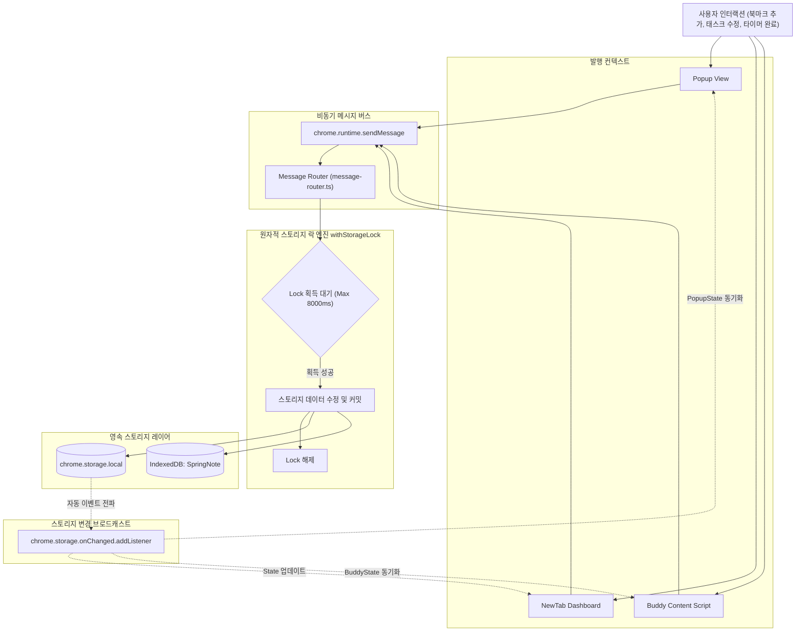
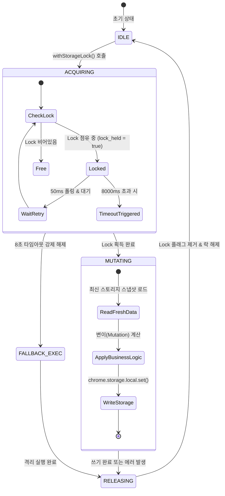
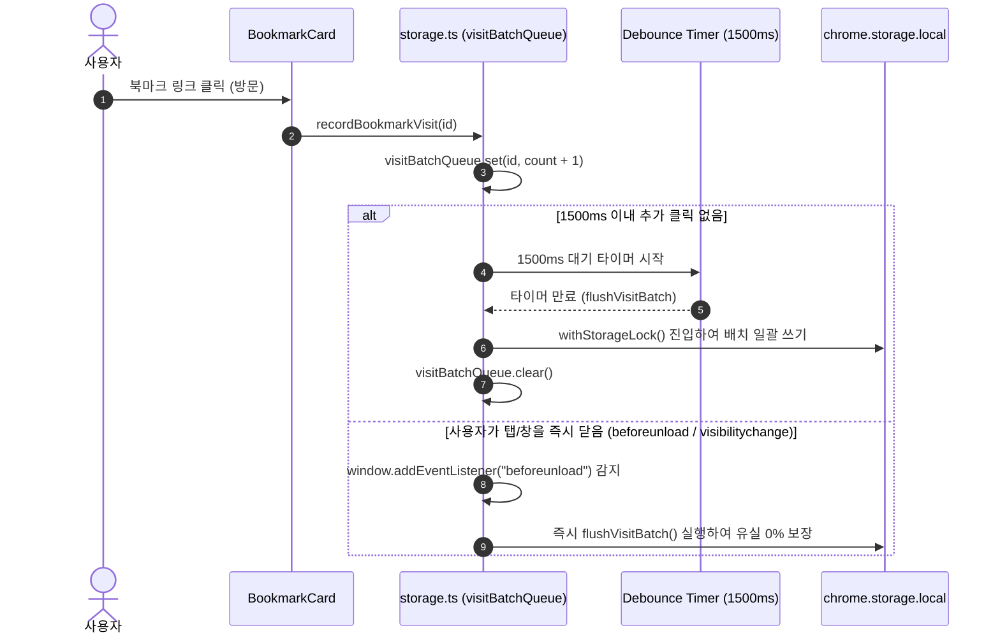

# 상태 흐름도 및 데이터 라이프사이클 명세서 (State Flow & Data Lifecycle)

> **문서 버전**: v1.0.0  
> **최종 수정일**: 2026-08-17  
> **대상 시스템**: ClickBook Data Flow & State Synchronization Engine

---

## 1. 개요 (Overview)

ClickBook은 여러 독립된 탭(Tab)과 윈도우, 백그라운드 서비스 워커 간에 데이터 불일치(Race Condition)가 발생하지 않도록 **단방향 데이터 흐름(Unidirectional Data Flow)**과 **원자적 스토리지 락(`withStorageLock`) 메커니즘**을 사용합니다.

---

## 2. 전역 상태 동기화 파이프라인 (Global Synchronization Pipeline)

---

## 3. 스토리지 락 FSM (Finite State Machine)

동시 다발적인 쓰기 요청으로부터 데이터 정합성을 보장하기 위해 `withStorageLock` 함수는 다음과 같은 유한 상태 기계(FSM)로 동작합니다.

---

## 4. 방문 통계 배치 큐 (Visit Batch Queue) 라이프사이클

북마크 클릭 시 빈번한 I/O로 인한 스토리지 부하를 최소화하기 위해 **1.5초 디바운스 배치 큐(`visitBatchQueue`)**를 운용합니다.

---

## 5. 스프링노트 (IndexedDB) 데이터 동기화 원칙

1. **단일 진실 공급원 (Single Source of Truth)**:
   - 스프링노트 본문(`content`) 및 캔버스 손글씨/드로잉 이미지 데이터는 대용량 바이너리를 지원하는 `IndexedDB(clickbook_spring_note_db)`에 영속화됩니다.
2. **트랜잭션 격리 (Transaction Isolation)**:
   - `readwrite` 트랜잭션을 통해 각 페이지별 델타 업데이트를 즉시 커밋합니다.
3. **통합 백업 동기화 (v2.1.0)**:
   - `exportData()` 호출 시 `getAllSpringNotes()`를 통해 IndexedDB 데이터를 일괄 추출하여 JSON 단일 백업 파일에 결합합니다.
   - `importData()` 호출 시 `saveAllSpringNotes()`를 통해 트랜잭션 단위로 전체 노트를 안전하게 복원합니다.
