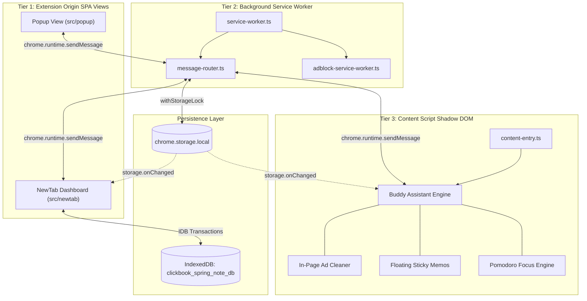
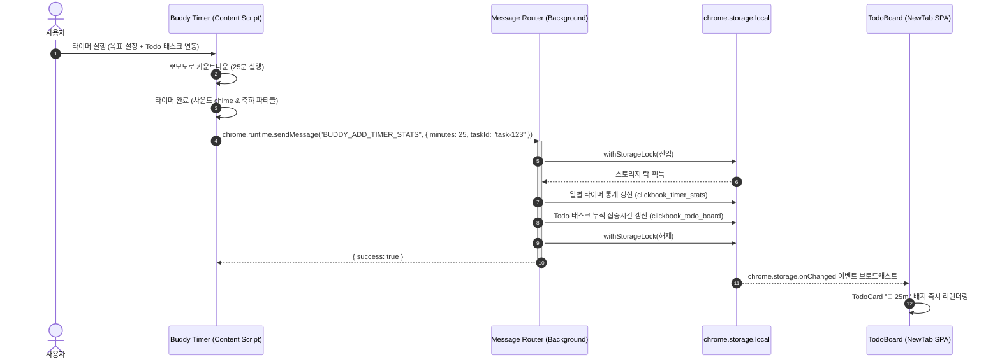

# 시스템 아키텍처 명세서 (System Architecture Specification)

> **문서 버전**: v1.0.0  
> **최종 수정일**: 2026-08-17  
> **대상 시스템**: ClickBook (클릭북) Manifest V3 아키텍처

---

## 1. 개요 (Overview)

ClickBook은 단일 책임 원칙(SRP)과 관심사 분리(SoC)를 기반으로 설계된 **Chrome Extensions Manifest V3 멀티 컨텍스트 SPA 플랫폼**입니다.  
확장 프로그램의 제약 사항인 **Service Worker 무상태성(Stateless)**, **Content Script 격리 환경(Isolated World)**, **SPA 대시보드 뷰(Extension Origin)** 간의 상호작용을 안정적인 비동기 메시지 버스와 분산 스토리지 아키텍처로 조율합니다.

---

## 2. 3계층 실행 컨텍스트 격리 모델 (3-Tier Execution Context)

---

## 3. 계층별 상세 역할 및 책임

### 3.1 Tier 1: Extension Origin (React 18 SPA Views)
- **Popup (`src/popup`)**:
  - 활성 탭 1클릭 캡처 및 AI 분류 미리보기.
  - 퀵 검색 및 최근 북마크 열람, 빠른 젠 리더모드 실행.
- **NewTab Dashboard (`src/newtab`)**:
  - 풀스크린 생산성 대시보드.
  - **스마트 북마크 그리드**: 폴더 트리, AI 태그 클라우드, 중복/404 클리너.
  - **칸반 TODO 보드**: @hello-pangea/dnd 기반 드래그 앤 드롭 태스크 관리.
  - **스프링노트 위키**: Tiptap 기반 아날로그 리치 텍스트 & 캔버스 드로잉 노트.
  - **2D 마인드맵**: @xyflow/react 기반 노드 다이어그램 및 AI 브랜치 자동 확장.
  - **실시간 테크 트렌드**: GitHub, Hugging Face, Hacker News, Wikipedia 랭킹.

### 3.2 Tier 2: Background Service Worker (Stateless Core)
- **메시지 라우팅 (`src/background/services/message-router.ts`)**:
  - 모든 컨텍스트의 요청을 단일 진입점에서 수신하고 적절한 비즈니스 서비스로 디스패치.
  - 비동기 처리 응답(`return true`) 계약을 엄격히 유지하여 채널 단절 방지.
- **스케줄러 & 알람 (`chrome.alarms`)**:
  - TODO 마감 기한 리마인더 및 알림 발송.
  - 트렌드 랭킹 캐시 주기적 갱신.
- **선언적 광고 차단 (`Declarative Net Request`)**:
  - 방해 요소 및 광고 스크립트 차단 규칙 관리.

### 3.3 Tier 3: Content Script & Shadow DOM Injection
- **초경량 부트스트래퍼 (`src/buddy/content-entry.ts`)**:
  - 웹페이지 로드 시 최소한의 번들만 로드하여 웹서핑 성능 저하 0% 달성.
  - 사용자가 버디 기능을 활성화했을 때만 `buddy-injector`를 동적 `import()`하여 주입.
- **Shadow DOM 캡슐화 (`#clickbook-buddy-root`)**:
  - `attachShadow({ mode: "open" })`을 통해 호스트 페이지의 글로벌 CSS와의 충돌을 원천 차단.
  - 뽀모도로 타이머, 플로팅 스티키 메모, 실시간 질의응답 AI 오버레이 실행.

---

## 4. 컴포넌트 상호작용 시퀀스 (Interaction Sequence)

### 4.1 포커스 타이머 완료 및 투두 보드 집중 시간 누적 시퀀스

---

## 5. 결론 및 아키텍처 원칙
1. **Zero-Latency Principle**: 온디바이스 AI(Gemini Nano)와 로컬 스토리지를 우선 사용하여 네트워크 지연 없는 즉각적인 사용자 반응성 확보.
2. **Crash-Resilience**: Storage Lock 타임아웃 가드, Content Script 고아 DOM 방지, Service Worker 비동기 채널 가드를 통해 브라우저 크래시 0% 달성.
3. **Strict Isolation**: Shadow DOM 및 W3C 웹 표준 준수를 통해 모든 웹페이지와 주요 브라우저(Whale, Chrome, Edge, Firefox, Safari)에서 완벽히 호환.
