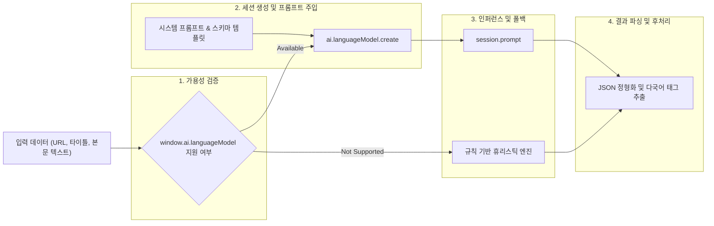
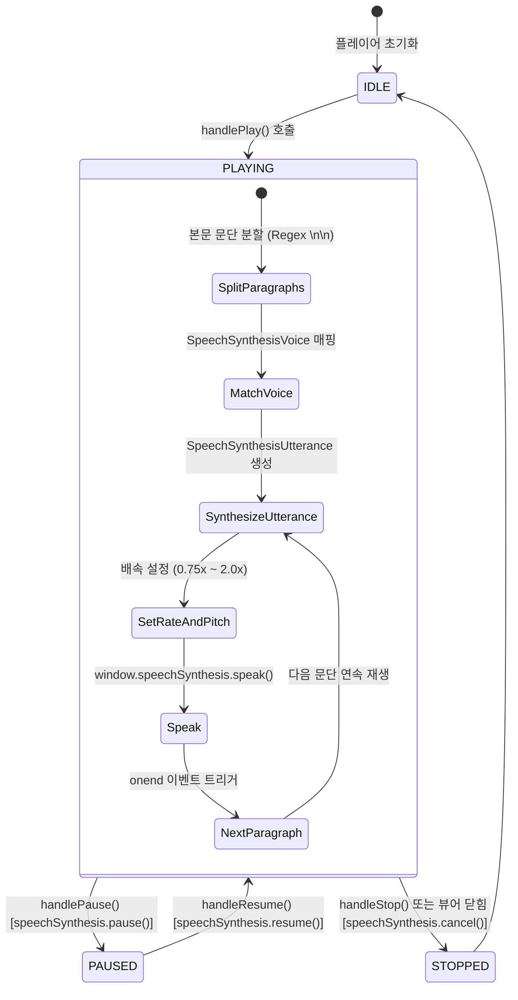

# AI 및 음성 합성 파이프라인 명세서 (AI & Voice Engine Pipeline)

> **문서 버전**: v1.0.0  
> **최종 수정일**: 2026-08-17  
> **대상 모듈**: Chrome Built-in AI (Gemini Nano) & Web Speech Synthesis

---

## 1. 개요 (Overview)

ClickBook은 외부 유료 API 서버나 클라우드 토큰 소모 없이 사용자의 브라우저 내장 하드웨어 가속을 활용하는 **100% 온디바이스 AI 및 음성 합성 아키텍처**를 제공합니다.  
본 문서는 Chrome Built-in AI(Gemini Nano)와 W3C Web Speech API(TTS)의 실행 파이프라인을 정의합니다.

---

## 2. Chrome Built-in AI (Gemini Nano) 파이프라인



---

## 3. Web Speech API (TTS) 음성 읽기 파이프라인

리더 모드(Reader Mode)에 탑재된 오디오 플레이어는 아티클 본문을 문단(Paragraph) 단위로 분할하여 끊김 없는 음성 읽기를 수행합니다.



---

## 4. 프롬프트 템플릿 규격 (Prompt Templates)

### 4.1 북마크 자동 분류 프롬프트 (`src/shared/categorizer.ts`)
```text
You are a smart bookmark categorizer. Analyze the given webpage title and URL, then classify it into the single best category and output 2~4 relevant hashtag keywords.

Format your response strictly as valid JSON:
{
  "category": "Technology | Development | Design | Finance | News | Lifestyle | Entertainment | Education | Other",
  "tags": ["keyword1", "keyword2", "keyword3"]
}

Title: {{title}}
URL: {{url}}
```

### 4.2 페이지 3줄 요약 프롬프트
```text
Summarize the main points of the following article in 3 concise bullet points in {{lang}} language.

Article:
{{text}}
```
