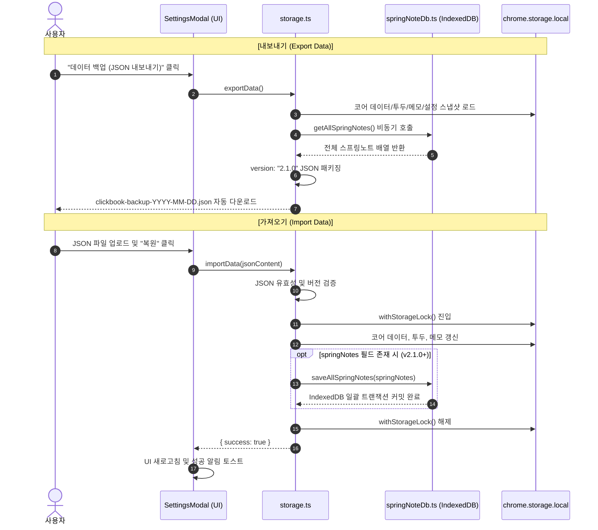

# 백업 포맷 및 데이터 마이그레이션 명세서 (Backup & Migration Specification)

> **문서 버전**: v2.1.0  
> **최종 수정일**: 2026-08-17  
> **관련 모듈**: `src/shared/storage.ts`, `src/utils/springNoteDb.ts`

---

## 1. 개요 (Overview)

ClickBook은 사용자의 모든 지식 자산(북마크, 투두 보드, 마인드맵, 스프링노트 위키, 리더모드 오프라인 캐시)을 단일 JSON 파일로 완벽하게 백업 및 복원할 수 있는 **통합 백업 아키텍처(Format v2.1.0)**를 지원합니다.

---

## 2. 통합 백업 포맷 규격 (ClickBookBackupData v2.1.0)

```typescript
interface ClickBookBackupData {
  version: "2.1.0";               // 백업 포맷 버전 식별자
  exportedAt: string;             // ISO 8601 타임스탬프
  
  // 1. 코어 북마크 & 폴더 데이터 (chrome.storage.local)
  data: ClickBookData;
  
  // 2. 투두 칸반 보드 데이터
  todoBoard?: TodoBoardData;
  
  // 3. 북마크 메모 데이터
  memos?: Record<string, BookmarkMemo>;
  
  // 4. 타이머 통계 데이터
  timerStats?: Record<string, DayTimerStats>;
  
  // 5. [신규 v2.1.0] 스프링노트 전체 IndexedDB 데이터
  springNotes?: SpringNote[];
  
  // 6. [신규 v2.1.0] 리더모드 오프라인 아티클 캐시
  pageContents?: Record<string, string>;
}
```

---

## 3. 백업 및 복원 트랜잭션 흐름도 (Export & Import Flow)



---

## 4. 하위 호환성 및 마이그레이션 전략 (Backward Compatibility)

ClickBook은 구버전 백업 파일을 가져올 때도 데이터 유실 없이 안전하게 최신 스키마로 승격시키는 **단계별 마이그레이션 파이프라인**을 갖추고 있습니다.

1. **v1.0.0 (레거시 북마크 단일 배열)**:
   - `folders`가 누락된 경우 루트 폴더(`root`)를 자동 생성하고 모든 북마크를 `root`에 안전하게 배치합니다.
2. **v2.0.0 (투두 보드 & 메모 도입)**:
   - `springNotes` 필드가 없더라도 오류 없이 기본 스토리지 데이터를 복원하며, 기존 IndexedDB는 보존합니다.
3. **v2.1.0 (스프링노트 & 리더모드 완전 통합)**:
   - 복원 시 `saveAllSpringNotes`를 통해 기존 노트를 덮어쓰거나 병합하여 멀티 디바이스 간 완벽한 동기화를 달성합니다.
