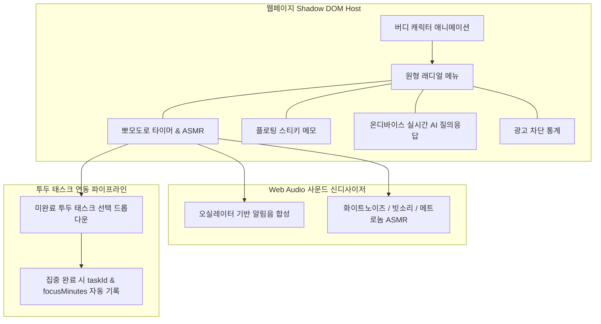

# AI 버디 데스크펫 & 뽀모도로 타이머 명세서 (Buddy System & Focus Timer Specification)

> **문서 버전**: v1.0.0  
> **최종 수정일**: 2026-08-17  
> **관련 모듈**: `src/buddy/`, `src/buddy/components/timer-card.ts`, `src/buddy/buddy-state.ts`

---

## 1. 개요 (Overview)

AI 버디(Buddy)는 사용자가 방문하는 모든 웹페이지의 우측 하단에 상주하는 **지능형 데스크펫 어시스턴트**입니다.  
사용자의 웹서핑 집중력을 높이기 위한 **뽀모도로 포커스 타이머**, **방해 요소 차단(DND) 모드**, **Web Audio 기반 사운드 신디사이저**, **투두 태스크 연동 누적 집중 시간 통계**를 제공합니다.

---

## 2. 버디 시스템 아키텍처 (Buddy Architecture)

---

## 3. 뽀모도로 타이머 ↔ 투두 태스크 연동 라이프사이클

1. **태스크 선택 (Task Binding)**:
   - 타이머 셋업 화면에서 사용자가 진행 중인 Todo 태스크를 선택하면 목표 문구가 자동 입력되고 `selectedTaskId`가 바인딩됩니다.
2. **집중 카운트다운 & DND 모드**:
   - 타이머 동작 중 DND(방해 금지) 모드를 활성화하면 웹페이지 내의 배너, 사이드바, 동영상 광고 영역이 블러(`blur(8px)`) 처리되어 몰입도를 극대화합니다.
3. **타이머 완료 및 통계 누적**:
   - 타이머 완료 시 Web Audio Chime 사운드와 함께 축하 파티클이 재생되며, 백그라운드 메시지(`BUDDY_ADD_TIMER_STATS`)를 통해 **일별 통계** 및 **해당 투두 태스크의 `focusMinutes`와 `focusCycles`**에 즉시 누적 저장됩니다.
