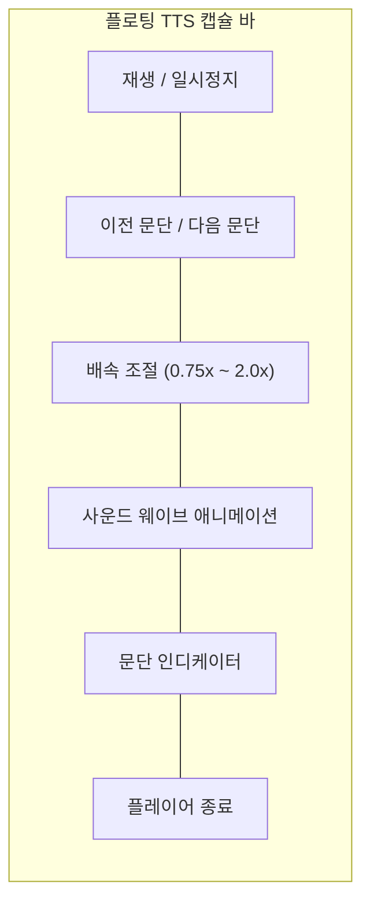

# 젠 리더 모드 및 TTS 오디오 플레이어 명세서 (Reader Mode & TTS Voice Player Specification)

> **문서 버전**: v1.0.0  
> **최종 수정일**: 2026-08-17  
> **관련 컴포넌트**: `src/components/ReaderModeViewer.tsx`, `src/components/ReaderModeViewer.css`

---

## 1. 개요 (Overview)

젠 리더 모드(Zen Reader Mode)는 웹페이지의 복잡한 배너, 광고, 내비게이션 바를 제거하고 **순수 아티클 본문만을 고가독성 타이포그래피 레이아웃으로 추출**하여 쾌적한 독서 경험을 제공합니다.  
v1.6.8에서는 **W3C Web Speech API 기반 플로팅 TTS 캡슐 플레이어**가 통합되어 웹 문서를 팟캐스트처럼 청취할 수 있습니다.

---

## 2. TTS 캡슐 오디오 플레이어 기능 명세

### 2.1 주요 컨트롤 및 동작 명세
- **재생 / 일시정지 (Play / Pause)**: Web Speech API `speechSynthesis.speak()` 및 `pause()`/`resume()`을 조율합니다.
- **문단 탐색 (Paragraph Navigation)**: 이전/다음 버튼 클릭 시 현재 읽고 있는 문단을 취소하고 즉시 대상 문단으로 점프하여 재생합니다.
- **배속 조절 (Speed Multiplier)**: `0.75x`, `1.0x`, `1.25x`, `1.5x`, `2.0x`를 실시간 전환합니다.
- **다국어 음성 엔진 자동 매칭**: 문서 언어 또는 사용자의 UI 언어 코드에 최적화된 고품질 시스템 보이스를 자동 선택합니다.
- **안전한 메모리 해제**: 뷰어가 닫히거나 컴포넌트 언마운트 시 `speechSynthesis.cancel()`을 즉시 호출하여 브라우저 백그라운드에서 소리가 계속 출력되는 현상을 원천 방지합니다.
