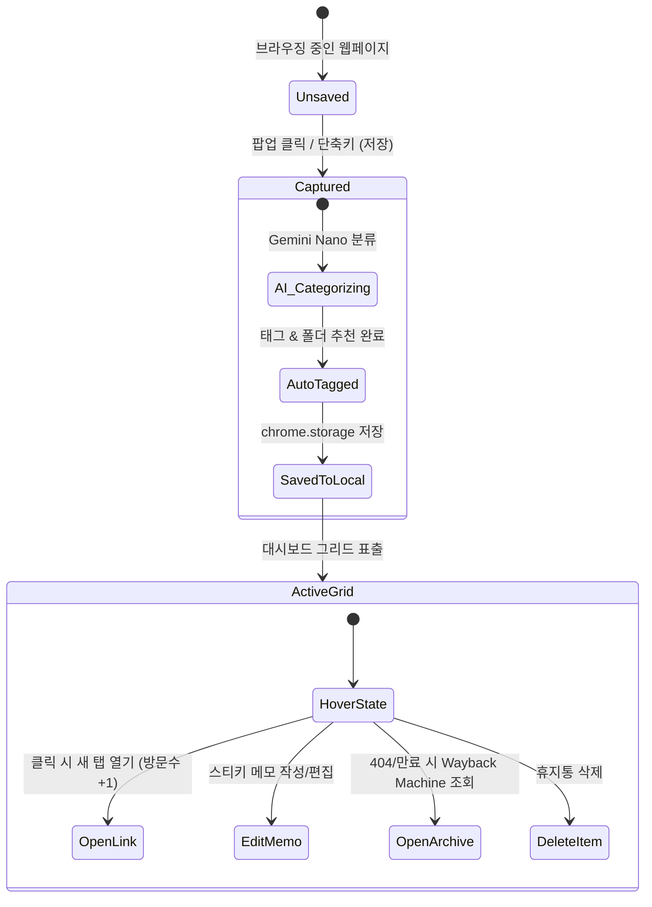

# 스마트 북마크 및 AI 지능형 정리 명세서 (Smart Bookmarks & AI Cleaner Specification)

> **문서 버전**: v1.0.0  
> **최종 수정일**: 2026-08-17  
> **관련 컴포넌트**: `src/components/BookmarkCard.tsx`, `src/components/AICleanerModal.tsx`, `src/shared/categorizer.ts`

---

## 1. 개요 (Overview)

스마트 북마크 모듈은 단순한 URL 저장을 넘어 **온디바이스 AI(Gemini Nano) 기반 자동 폴더 분류**, **의미 기반 중복 감지**, **HSL 동적 색상 태그 클라우드**, **만료된 웹페이지(404)에 대한 Wayback Machine 원클릭 웹 아카이브 복구** 기능을 통합 제공합니다.

---

## 2. 주요 기능 상세 명세 (Key Features)

### 2.1 1-Click 스마트 캡처 & 온디바이스 AI 자동 분류
- 브라우저 액션 아이콘 또는 단축키 클릭 시 현재 활성 탭의 타이틀, URL, 메타 태그를 수집합니다.
- Chrome 내장 Gemini Nano(`window.ai.languageModel`)를 통해 최적의 폴더를 추천하고 핵심 해시태그(`#React`, `#Design`, `#AI` 등)를 자동 생성합니다.

### 2.2 지능형 중복 정리 클리너 (`AICleanerModal`)
- 정규화된 URL 일치뿐만 아니라, **의미론적 유사성(Semantic Similarity)**을 분석하여 동일한 콘텐츠를 다루는 중복 북마크 그룹을 검출합니다.
- 그룹 내에서 가장 먼저 저장된 원본을 "유지(Keep)" 항목으로 추천하며, 불필요한 사본을 원클릭으로 일괄 삭제할 수 있습니다.

### 2.3 데드 링크(404) 감지 및 웹 아카이브(Wayback Machine) 복구
- 사이트가 폐쇄되었거나 URL이 변경되어 페이지에 접근할 수 없는 경우, 카드 호버 메뉴 및 AI 클리너에서 **Wayback Machine 아카이브(`https://web.archive.org/web/*/{url}`)** 바로가기 링크를 제공하여 과거 저장본을 즉시 열람할 수 있습니다.

---

## 3. 북마크 인터랙션 상태도 (Bookmark Interaction State)

