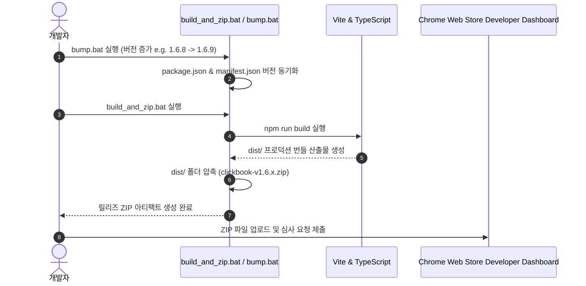

# 릴리즈 및 스토어 배포 가이드 (Release & Store Deployment Guide)

> **문서 버전**: v1.0.0  
> **최종 수정일**: 2026-08-17  
> **대상 플랫폼**: Chrome Web Store, Edge Add-ons, Whale Store

---

## 1. 릴리즈 워크플로우 (Release Workflow)

---

## 2. 배포 전 필수 체크리스트

1. **버전 동기화 (Version Synchronization)**:
   - `package.json`의 `"version"`과 `manifest.json`의 `"version"`이 정확히 일치하는지 확인.
2. **프로덕션 번들 무결성**:
   - `npm run build` 실행 시 콘솔에 에러나 번들링 실패가 없어야 함.
3. **권한 및 개인정보 보호정책 (Privacy Policy)**:
   - `PRIVACY_POLICY.md` 최신 상태 유지 및 스토어 대시보드에 개인정보 취급방침 URL 등록.
   - 단일 목적 원칙(Single Purpose Policy) 준수 설명 작성.
4. **프로모션 에셋 준비**:
   - 스토어 등록용 마키 배너 (`docs/promo_marquee_1400x560.png`), 스몰 타일 (`docs/promo_small_440x280.png`), 스크린샷 준비 완료.
