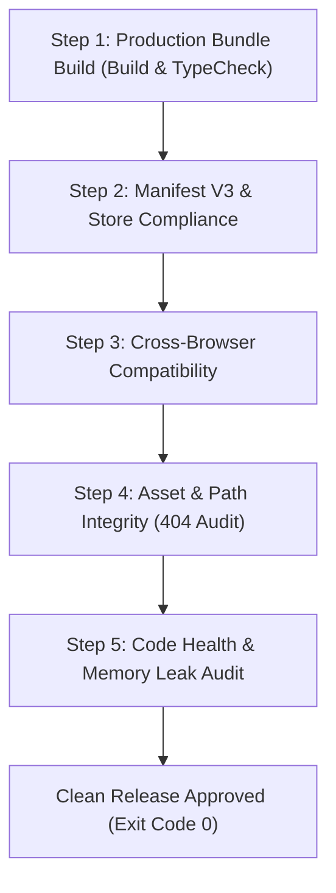

# 릴리즈 품질 검증 프로토콜 (Release Verification & QA Guide)

> **문서 버전**: v1.0.0  
> **최종 수정일**: 2026-08-17  
> **검증 대상**: ClickBook Release Candidate (RC) Packages

---

## 1. 5단계 릴리즈 심층 검증 체크리스트 (5-Step Deep Audit Checklist)

모든 릴리즈 배포 전 아래 5단계 검증 프로토콜을 순차적으로 통과해야 합니다.



---

## 2. 세부 검증 항목 및 커맨드

### Step 1: 프로덕션 번들 빌드 & 타입 무결성 검증
```bash
# 타입스크립트 타입 에러 전수 검증 (0 errors)
npx tsc --noEmit

# Vite 멀티 엔트리 프로덕션 빌드 (Exit code: 0)
npm run build
```

### Step 2: Manifest V3 & 스토어 정책 준수 검사
- `"manifest_version": 3` 규격 준수 여부.
- `permissions` 및 `host_permissions`에서 불필요한 와일드카드(`<all_urls>`) 지양 및 최소 권한 원칙(Least Privilege) 준수.
- 16x16, 48x48, 128x128 런처 아이콘 물리적 존재 여부.

### Step 3: W3C 크로스 브라우저 호환성 검사
- 폐기 예정(Deprecated) API (`document.execCommand`, `KeyboardEvent.keyCode`) 사용 0건.
- Injected Shadow DOM 내 CSS 격리 및 호스트 DOM 오염 방지 확인.

### Step 4: 에셋 경로 무결성 (404 방지) 검사
- 확장 프로그램 내의 정적 에셋 로드 시 `chrome.runtime.getURL()` 표준 리졸버 사용 여부.
- 캐릭터 스프라이트, UI 아이콘, 사운드 chime 파일 누락 여부 확인.

### Step 5: 메모리 누수 및 리스너 해제 검사
- 컴포넌트 언마운트 시 `removeEventListener`, `clearInterval`, `speechSynthesis.cancel()` 호출 보장 여부.
- `withStorageLock` 8000ms 타임아웃 가드 및 폴백 동작 검증.
