# ClickBook (클릭북) 시스템 아키텍처 및 엔지니어링 문서 허브

> **ClickBook (v1.7.1)** — Chrome Manifest V3 기반 차세대 AI 북마크 & 지식 관리 생산성 플랫폼  
> 온디바이스 AI(Gemini Nano), 스프링노트 위키, 투두 캘린더, 실시간 트렌드 랭킹 및 상호작용 데스크펫 버디(Buddy)가 결합된 통합 확장 프로그램 시스템

---

## 📚 기술 문서 체계 (Documentation Map)

```
docs/
├── ARCHITECTURE.md                  # [현재 문서] 전체 시스템 요약 및 아키텍처 인덱스
│
├── 01_architecture/                # 시스템 구조 및 런타임 설계
│   ├── system-architecture.md      # 전체 시스템 구성도, MV3 격리 모델, 레이어드 아키텍처
│   ├── data-flow.md                # 상태 흐름도 (State Flow), 이벤트 라이프사이클, FSM
│   └── cross-browser-spec.md       # W3C 멀티 브라우저 호환성 & Shadow DOM 캡슐화
│
├── 02_protocols/                   # 통신 및 인터페이스 명세
│   ├── message-protocol.md         # 백그라운드 ↔ 팝업 ↔ 버디 ↔ NewTab 전수 메시지 프로토콜
│   └── ai-pipeline.md              # Chrome Gemini Nano (Prompt/Summarizer) & TTS 파이프라인
│
├── 03_storage/                     # 데이터 영속성 및 스토리지
│   ├── storage-schema.md           # chrome.storage.local & IndexedDB(SpringNote) 스키마 명세
│   └── backup-migration.md         # JSON v2.1.0 백업/복원 포맷 & 버전 마이그레이션 전략
│
├── 04_features/                    # 주요 기능 상세 명세 (Feature Specifications)
│   ├── smart-bookmarks.md          # 북마크 트리, AI 자동분류, 중복 정리, 404 아카이브 복구
│   ├── buddy-system.md             # 버디 상태머신, 뽀모도로 타이머, Web Audio 사운드 엔진
│   ├── todo-calendar.md            # 칸반 보드, Tiptap 스프링노트, 공휴일 캘린더 연동
│   └── reader-mode-tts.md          # 젠 리더모드 뷰어 & Web Speech TTS 음성 플레이어
│
└── 05_devops_and_qa/               # 품질 보증 및 배포
    ├── verification-guide.md       # 5단계 릴리즈 품질 검증 프로토콜 (QA)
    └── release-process.md          # Web Store 릴리즈 절차 & Manifest V3 정책 준수 가이드
```

---

## 🏛️ 하이레벨 아키텍처 개요 (High-Level Architecture)

ClickBook은 Chrome Extensions Manifest V3 표준을 엄격히 준수하며, **3개의 핵심 실행 컨텍스트(Execution Contexts)**로 분리되어 구동됩니다.

```mermaid
flowchart TB
    subgraph HostWebPage [Host Web Pages Active Tabs]
        HostDOM["Webpage DOM"]
        BuddyUI["Buddy Companion Character"]
        StickyMemos["Floating Sticky Memos"]
        TimerPanel["Pomodoro Focus Timer"]
        AdBlockEngine["@ghostery/adblocker Engine"]
        BuddyUI --- StickyMemos
        BuddyUI --- TimerPanel
        BuddyUI --- AdBlockEngine
    end

    subgraph ExtensionViews [Extension Views React 18 SPA]
        PopupView["Popup Action UI (src/popup)"]
        NewTabView["NewTab Dashboard (src/newtab)"]
        BMGrid["Smart Bookmarks Grid"]
        TodoBoard["Kanban TODO Board"]
        SpringNote["Tiptap Spring Notes (IndexedDB)"]
        MindMap["2D MindMap Board (@xyflow)"]
        TrendRanking["Live Tech Trends (GitHub/HF/HN)"]
        ReaderViewer["Zen Reader Mode + TTS"]
        NewTabView --- BMGrid
        NewTabView --- TodoBoard
        NewTabView --- SpringNote
        NewTabView --- MindMap
        NewTabView --- TrendRanking
        NewTabView --- ReaderViewer
    end

    subgraph BackgroundServiceWorker [Background Service Worker]
        Router["Message Router (message-router.ts)"]
        AlarmMgr["Alarms and Schedule Manager"]
        ContextMenus["Context Menus Handler"]
        AdBlockRules["Declarative Net Request Filters"]
        TabListener["Tab and Navigation Listeners"]
        Router --- AlarmMgr
        Router --- ContextMenus
        Router --- AdBlockRules
        Router --- TabListener
    end

    subgraph PersistenceLayer [Local Storage and Database]
        ChromeStorage[("chrome.storage.local")]
        SpringNoteDB[("IndexedDB: clickbook_spring_note_db")]
    end

    BuddyUI <-->|chrome.runtime.sendMessage| Router
    PopupView <-->|chrome.runtime.sendMessage| Router
    NewTabView <-->|chrome.runtime.sendMessage| Router
    Router <-->|withStorageLock / CRUD| ChromeStorage
    SpringNote <-->|IDB Transactions| SpringNoteDB
    ChromeStorage -.->|storage.onChanged| ExtensionViews
    ChromeStorage -.->|storage.onChanged| HostWebPage
```



---

## ⚡ 핵심 기술 스택 및 라이브러리

| 영역 | 기술 스택 | 핵심 용도 및 특징 |
| :--- | :--- | :--- |
| **코어 플랫폼** | Chrome Extensions **Manifest V3** | 최신 웹 표준 준수, Service Worker 기반 백그라운드 이벤트 처리 |
| **프론트엔드 프레임워크** | **React 18.3** + TypeScript 5.5 | 가상 DOM 렌더링, 엄격한 정적 타입 검사, 고성능 컴포넌트 구조 |
| **번들러 & 빌드** | **Vite 5.4** + Rollup | 다중 엔트리(Popup, NewTab, Background, Content) 초고속 HMR 및 빌드 |
| **스타일링** | **TailwindCSS** + Vanilla CSS Variables | HSL 테마 시스템 (Light, Dark, Midnight, OLED Dark, Sepia, Nordic Forest, Cyberpunk, Lavender Rose) |
| **리치 텍스트 에디터** | **Tiptap (ProseMirror)** 2.27 | 아날로그 스프링노트, WYSIWYG, 테이블, 태스크 리스트, 드로잉 노드 확장 |
| **드래그 앤 드롭** | **@hello-pangea/dnd** 18.0 | 칸반 투두 보드 및 북마크 폴더 트리 정밀 드래그 앤 드롭 |
| **노드 다이어그램** | **@xyflow/react** (React Flow) + Dagre | 2D 인터랙티브 마인드맵 및 지식 네트워크 시각화 |
| **온디바이스 AI** | **Chrome Built-in AI (Gemini Nano)** | `window.ai.languageModel` 및 `window.ai.summarizer` 기반 로컬 실시간 처리 |
| **음성 합성 (TTS)** | **W3C Web Speech API** | 브라우저 내장 음성 엔진 기반 다국어 텍스트 읽기 및 배속 재생 |
| **광고 차단 엔진** | **@ghostery/adblocker** 2.18 | 웹서핑 중 방해 광고 차단 및 쾌적한 젠 리더모드 경험 제공 |
| **데이터 스토리지** | `chrome.storage.local` + **IndexedDB** | 원자적 락(`withStorageLock`) 보장 스토리지 및 대용량 리치 노트 DB |
| **다국어 (i18n)** | 자체 경량화 다국어 엔진 (`useLang`) | 7개 국어(`ko`, `en`, `ja`, `zh-CN`, `zh-TW`, `de`, `es`) 100% 실시간 전환 |

---

## 🚀 빠른 시작 및 개발 가이드

```bash
# 1. 의존성 패키지 설치
npm install

# 2. 실시간 개발 빌드 (Watch Mode)
npm run dev

# 3. 배포용 프로덕션 번들 빌드
npm run build

# 4. 타입스크립트 타입 무결성 검증
npx tsc --noEmit
```

빌드 산출물은 `dist/` 디렉토리에 생성되며, 크롬 브라우저의 `chrome://extensions`에서 **[압축해제된 확장 프로그램을 로드합니다]**를 통해 `dist/` 폴더를 로드하여 테스트할 수 있습니다.
